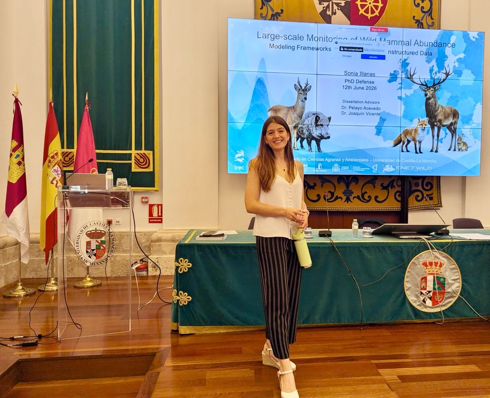

<!--
## Working areas

:::: {.columns}

::: {.column width="33%"}

### Quantitative Ecology

Aplicación de métodos estadísticos para comprender patrones ecológicos y procesos que no pueden observarse directamente.

:::

::: {.column width="33%"}

### Occupancy & Abundance

Desarrollo y aplicación de modelos que consideran la detectabilidad imperfecta y permiten estimar la distribución y abundancia de las especies.

:::

::: {.column width="33%"}

### Ciencia reproducible

Análisis, documentación y herramientas desarrolladas principalmente con R, Quarto y control de versiones.

:::

::::

---

-->

## News

:::: {.home-news-single}

::: {.home-news-image}
{
  .home-news-photo
  fig-alt="Sonia Illanas antes de la defensa de su tesis doctoral."
}
:::

::: {.home-news-text}

<strong> 
PhD Defense!
</strong>

I'm so happy to have defended my PhD! It wouldn't be possible without  my advisors, all the support I've received from my family and friends throughout the years, and my committe members for making such a great effort to be there. 

<b>THANK YOU ALL SO MUCH! </b>

[PhD link](phd.qmd){.btn .home-publication-button}

 [Scripts to statistical analysis](https://github.com/robinilla/PhD_thesis){.btn .home-publication-button}

:::

::::

## What to find in this website?

- Publications & Technical Docs.
- My PhD (book & scripts).
- Participation in Conferences.
- My academic & professional path.

<!--- 
- My research & ongoing projects.
- Aplicaciones interactivas desarrolladas con R y Shiny.
- Teaching matherials.
-->
