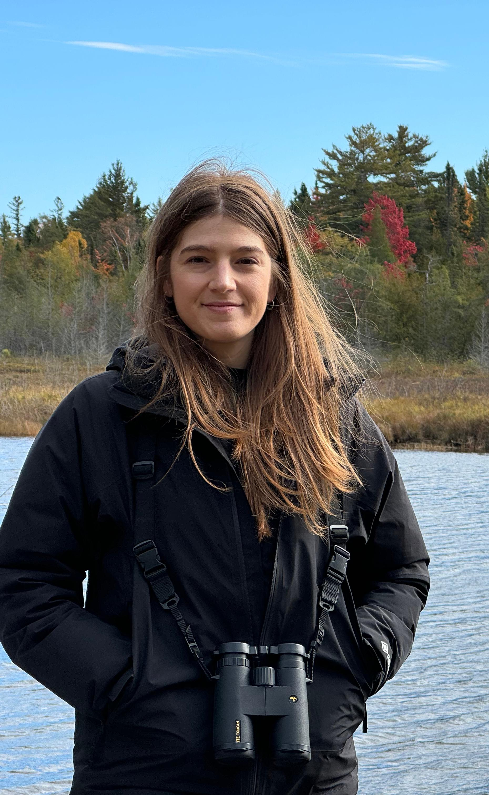

:::: {.people-profile}

::: {.people-photo}
{
  .people-portrait
  fig-alt="Retrato de Sonia Illanas"
}
:::

::: {.people-summary}

## Sonia Illanas

My work focuses on analyzing ecological data to infer large-scale patterns in wildlife distribution and abundance. I am particularly interested in how different analytical decisions affect the inferences we draw, as well as in developing and implementing quantitative methods that improve the reliability of estimates used for biodiversity monitoring. I primarily use <b>R</b> to conduct these analyses and produce reproducible code that can be useful to other users.

- **PhD in Agricultural and Environmental Sciences**. University of Castilla-La Mancha (UCLM). 2021-2026. 
- **MSc in Ecology**. Autonomous and Complutense University of Madrid (UAM-UCM). 2016-2018.
- **BSc in Environmental Engineer**. Technical University of Madrid (UPM). 2011-2016.

::: {.people-links}
[e-mail](mailto:sonia.illanas@uclm.com) · 
[GitHub](https://github.com/robinilla) · 
[Google Scholar](https://scholar.google.com/citations?user=ew25H7QAAAAJ&hl=es) · 
[Researchgate](https://www.researchgate.net/profile/Sonia-Illanas?ev=hdr_xprf)
:::

:::

::::

## Professional & Academic Experiences

- Once I finished my BSc in Environmental engineering, I worked few months at the Technical University of Madrid (UPM) under the supervision of [Prof. Santiago Saura](https://scholar.google.com/citations?user=kOLDlZUAAAAJ&hl=en#d=gsc_md_hist&t=1784720512838) and [Dr. Carlos Ciudad](https://scholar.google.com/citations?hl=en&user=SNNgtAQAAAAJ&view_op=list_works&sortby=pubdate) on the GEFOUR project, focused on the study of species distribution models (SDMs) on the Cantabrian brown bear. 
- While pursuing my Master's degreee in Ecology, I got the opportunity to complete an internship at [WWF-España](https://www.wwf.es/). After the intership, I continued working with the organization on serveral projects related to assessing the favorable conservation status of the [Iberian lynx](https://www.wwf.es/?52400/Conclusiones-de-las-Jornadas-El-lince-iberico-mirando-hacia-el-futuro) and the [European wild rabbit](https://www.wwf.es/nuestro_trabajo/especies_y_habitats/conejo/?47980/Conservacionistas-agricultores-e-instituciones-se-alan-para-prevenir-los-daos-del-conejo-en-los-cultivos).
- I spent one year working at [INECO](https://www.ineco.com/ineco/proyectos/alta-velocidad-hs2), where I managed wildlife databases and developed data visualization to support the environmental impact assessment of the [High Speed 2 project](https://www.hs2.org.uk/).

-I recently completed my <b>PhD</b> at the [IREC, CSIC-UCLM-JCCM](https://www.irec.es/) as part of the Agricultural and Environmental Sciences doctoral program at the University of Castilla-La Mancha (UCLM). My PhD was funded by the Spanish Ministry of Science and Innovation through an FPI fellowship and supervised by [Dr. Pelayo Acevedo](https://scholar.google.com/citations?hl=en&user=vecKO2QAAAAJ&view_op=list_works&sortby=pubdate) & [Prof. Joaquín Vicente](https://scholar.google.com/citations?hl=en&user=LKuXcdsAAAAJ). In my doctoral research, I used hunting statistics and camera-trap data to study the distribution and abundance of wild mammals across Spain and Europe. Through the [ENETWILD project](www.enetwild.com), I collaborated with partners from academia, government agencies, and wildlife management organizations to collect and harmonize wildlife data from countries across Europe.

## What about free time?

I love swimming, although I enjoy just about any sport! After a long break I returned to my passion for the water, and it was the best decision I made while working on my dissertation. 
Swimming has taugh me so much, and I believe it has a lot in common with science: discipline, hard work, sacrifice, and dedication: perseverance and tenacity. It’s trying again and again without giving up. Learning that frustration is simply another opportunity to do it better the next time. “...life is all about to overcome problems, like getting better and improve… . " Thanks [Eddie](https://www.youtube.com/watch?v=6vN6QZInV98) for teaching me so much.

**If there is a will, there is a way.** <strong> Happy coding! :) </strong>
